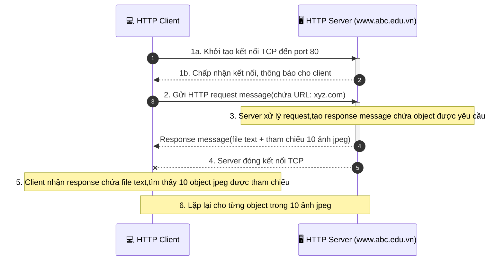
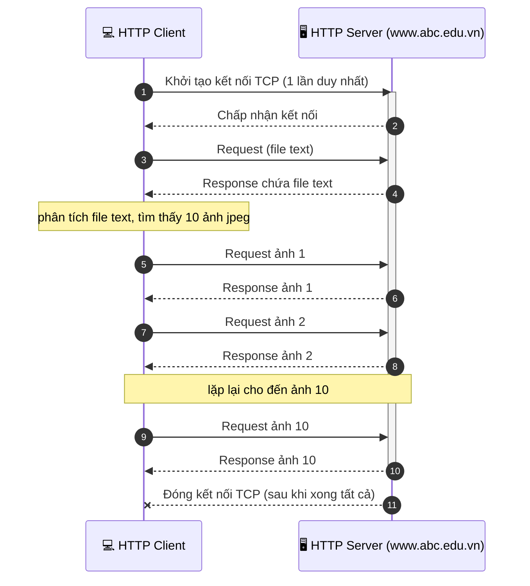

# 1. HTTP - HyperText Transfer Protocol
### 1.1 HTTP là gì?
- HTTP là giao thức của ứng dụng web

    - Thông thường hoạt động theo mô hình Client - Server 

        -> web browser tạo requests và nhận được response từ web server. Web server sẽ luôn ở trạng thái sẵn sàng nhận requests từ browser
    
    - Khi server nhận được yêu cầu, nó sẽ kiểm tra xem nó có những thứ mà client yêu cầu hay không nếu có thì server sẽ gửi lại theo yêu cầu (thông qua http)
- HTTP dùng giao thức TCP ở layer 4 (đảm bảo dữ liệu luôn chính xác)
### 1.2 Quá trình HTTP dùng TCP
- Client sẽ khởi tạo kết nối TCP đến server (port 80)
- Server nhận được yêu cầu kết nối sẽ xem xét accept
- Client sau khi biết server đã accept, các thông điệp được định dạng ở HTTP sẽ được trao đổi từ Client - Server
- Sau khi trao đổi hoàn thành thì TCP sẽ đóng lại connect

-> HTTP không duy trì các thông tin liên quan đến các lần trao đổi trước ( Stateless )
### 1.3 HTTP Non-persistent và HTTP persistent
 
VD: user nhập www.abc.edu.vn/xyz.com (mục đích đến URL này để lấy 1 file text và 10 ảnh jpeg) cho cả 2 trường hợp

1.3.1 HTTP Non-persistent (kết nối ko liên tục)
- TCP phải mở kết nối
- Sau khi trao đổi xong 1 đối tượng
- TCP sẽ đóng kết nối

-> lặp lại nhiều lần tạo kết nối và đóng kết nối để truyền dữ liệu lớn

    - Vấn đề mỗi lần lấy 1 object phải tạo 1 kết nối

- RTT (Round Trip Time) : thời gian đi được 1 vòng của gói tin bắt đầu tính từ lúc client gửi yêu cầu kết nối tới server
- cứ mỗi 1 object = RTT tạo và đợi kết nối + RTT tạo và đợi request + time data transmission

-> RTT rất cao và dễ gây ảnh hưởng đến trải nghiệm người dùng và hiệu suất của hệ thống

1.3.2 HTTP persistent (kết nối liên tục)
- TCP sẽ mở kết nối tới server
- Nhiều đối tượng được trao đổi qua kết nối này
- sau khi trao đổi xong TCP sẽ đóng kết nối

-> Chỉ cần 1 RTT cho mỗi object
### 1.4 Các thành phần chính của HTTP
1.4.1 HTTP Request: Là thông điệp để chỉ ra hành động client mong muốn được thực hiện 
    
    -Cấu trúc của 1 Requests: 
    Requests line = Method + URI–Request + HTTP Version 
    Header: có thể có hoặc không
    Dòng trống phân cách header và body
    Body: data gửi lên server

HTTP Response: là thông điệp mà server gửi ngược lại cho client sau khi xử lý request, chứa kết quả của yêu cầu đó.

    -Cấu trúc của 1 Response: 
    Status line = HTTP Version + Status Code + Mô tả
    Header: có thể có hoặc không
    Dòng trống phân cách header và body
    Body: data server trả về cho Client

### 1.4 Các methods chính của Requets
- Post: thông thường sử dụng khi sử dụng trang web có 1 form điền thông tin vào -> ấn gửi -> phần thông tin này sẽ được đặt trong phần body của requests HTTP
- Get: cũng dùng để gửi dữ liệu về server như Post nhưng dữ liệu sẽ thường nằm trong phần URL 
- Head: Khi server nhận yêu cầu của phương thức Head thì chỉ trả về phần header (Kích thước, Thời gian, Lần cuối cùng được sửa,..) 
- Put: tải các object mới lên server, thay thế đối đợi mới hơn 

### 1.5 Các Status thường gặp của Response
1xx: information Message: các status này có tính tạm thời, có thể ko quan tâm

2xx Successful: Khi xử lí thành công request của client

    - 200 OK: Thành công
    - 202 Accepted: Đã nhận Requests chưa có kết quả trả về -> tiếp tục đợi
    - 204 No Content: request đã được xử lý nhưng không có thành phần nào được trả về
    - 205 Reset: giống như 204 nhưng còn yêu câu client reset lại document view
    - 206 Partial Content: server chỉ gửi về một phần dữ liệu, phụ thuộc vào giá trị range header của client đã gửi
3xx Redirection: server thông báo cho client phải thực hiện thêm thao tác để hoàn tất request

4xx Client error: lỗi của client:

    -400 Bad Request: request không đúng dạng, cú pháp
    -401 Unauthorized: client chưa xác thực
    -403 Forbidden: client không có quyền truy cập
    -404 Not Found: không tìm thấy tài nguyên
    -405 Method Not Allowed: phương thức không được server hỗ trợ

5xx Server Error: lỗi của server

    -500 Internal Server Error: có lỗi trong quá trình xử lý của server
    -501 Not Implemented: server không hỗ trợ chức năng client yêu cầu
    503: Service Unavailable: Server bị quá tải, hoặc bị lỗi xử lý
