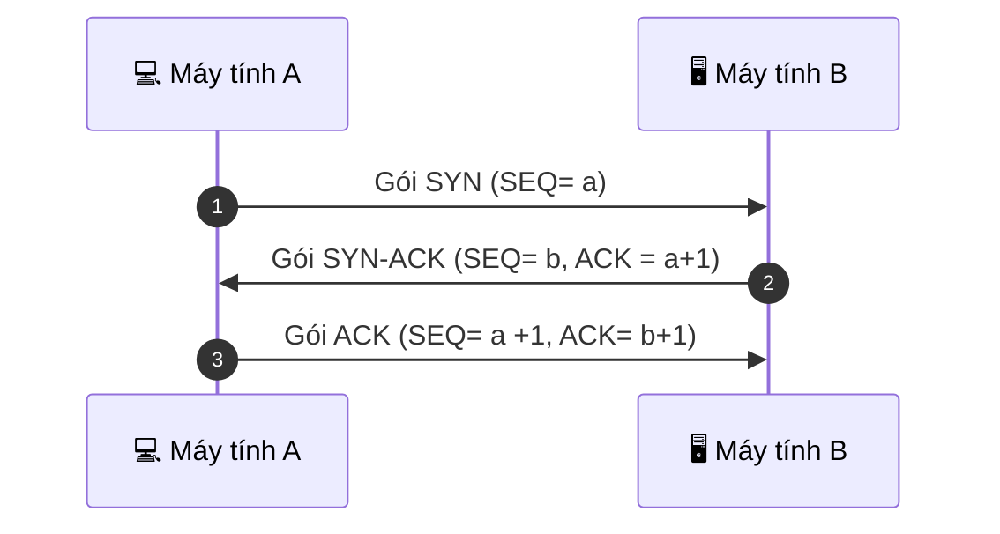
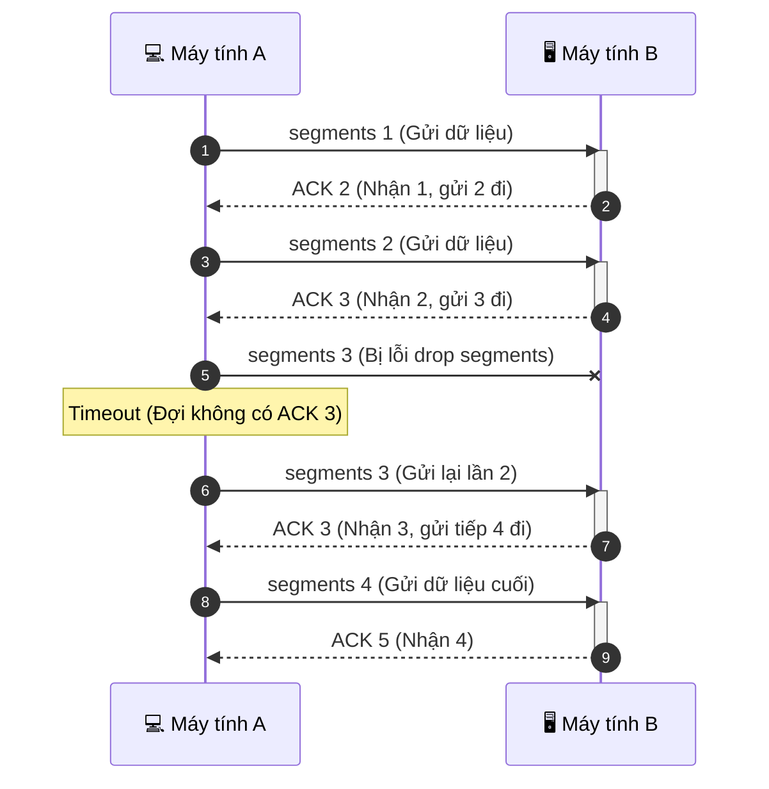
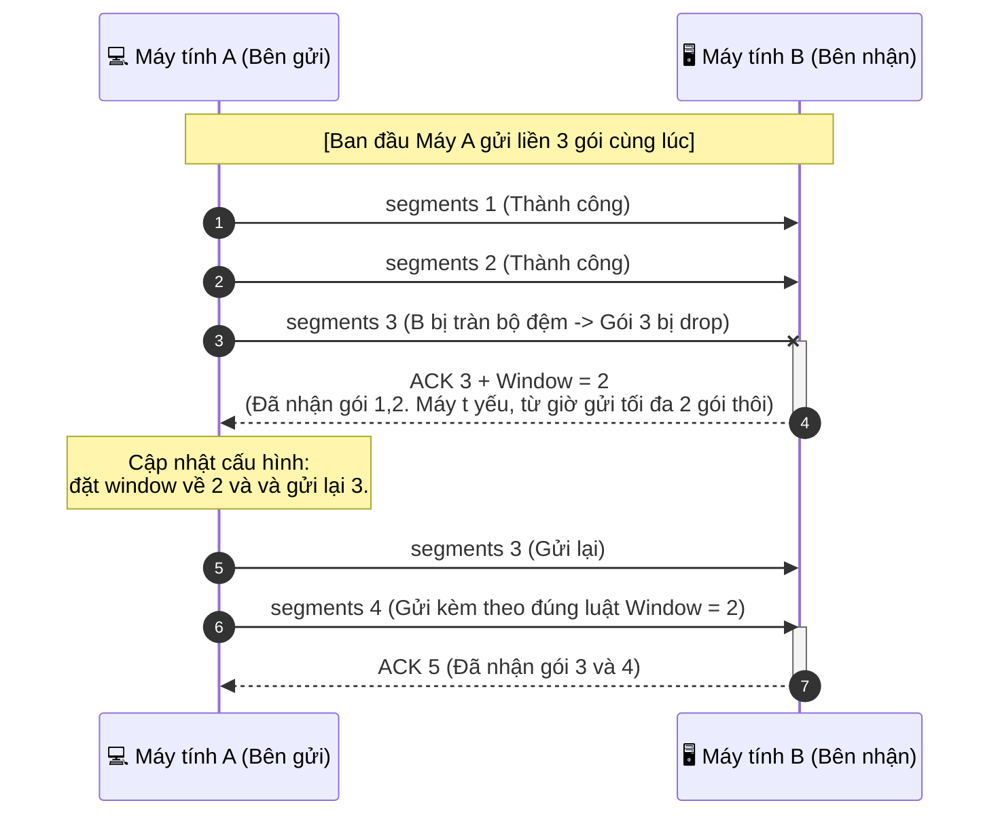
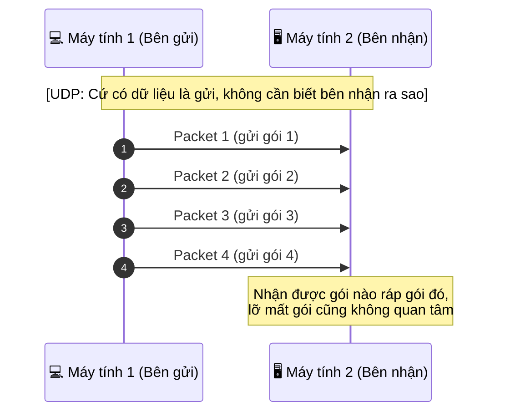

## 1. IP
1.1 Phân biệt địa chỉ MAC và địa chỉ IP


    MAC addess: là địa chỉ vật lí, cố định, mỗi thiết bị có 1 địa chỉ riêng gắn liền, vĩnh viễn dùng để định danh phần cứng như card mạng và hoạt động trong layer 2 (datalink), mạng local

    IP address: là địa chỉ logic dùng để định danh các thiết bị kết nối với nhau do  DHCP protocol điều phối nên IP sẽ có tính động (DHCP sẽ tự điều phối theo từng thời điểm khác nhau, không cố định như MAC address), còn với IP tĩnh được cấp phát bằng cách gán tay cố định, hoạt động trong layer 3 (network)
1.2 Phân loại theo phạm vi hoạt đông

    IP private: Chỉ sử dụng được trong mạng local ->ưu điểm: bảo mật không cho xâm nhập từ bên ngoài, khả năng mở rộng cao-> Nhược điểm: Không thể truy cập trực tiếp qua internet, có khả năng trùng lặp
        -> Có thể truy cập internet thông qua các thiết bị như router,.. thường được sử dụng trong doanh nghiệp và các thiết bị gia đình
    IP public: Xác định mỗi thiết bị hoạt động trên internet, cho phép các thiết bị kết nối với nhau, do nhà mạng cung cấp -> Không thể có 2 thiết bị có cùng IP public trên internet tại cùng 1 thời điểm

1.3 Cách thức hoạt động của IP

    1: Khi gửi 1 file, video,... dữ liệu sẽ không đi liền 1 khối mà sẽ được đóng header chuyển thành các segment ở layer transport
    2: Đến layer network các segment sẽ được đóng thêm header trong đó có source IP, và destination IP, chuyển thành các packet để truyền đi nhanh và reliable
    3: Quá trình định tuyến routing: gói tin sẽ đến router -> router nhìn vào destination tìm con đường tối ưu nhất để đến receiver
    4: receiver dựa vào source Ip để xác định ai đã gửi tức là receiver cũng có được ip của sender, tiến hành mở gói tin (Decapsulation) sau đó sắp xếp lại các gói tin (đối với TCP protocol) hoặc không (đối với UDP protocol).
1.4 IPv4 và IPv6 

Khái niệm: cả 2 là giao thức không kết nối, cung cấp kết nối logic, nhận diện thiết bị hoạt động trong internet. IPv4 là ip protocol hiệu quả ổn định, được phát triển và sử dụng rộng rãi hiện nay. Tuy nhiên cấu trúc IPv4 gồm 32bits -> khoảng 4 tỷ ip dẫn đến sự thiếu hụt không gian ip vể sau, từ đó IPv6 ra đời với 128bits nhằm giải quyết vấn đề thiếu hụt không gian của Ipv4

    -> IPv4 và IPv6 đều hoạt động song song ở thời điểm hiện nay, nhưng vì có mạng NAT hoạt động tốt giải quyết được vấn đề thiếu hụt không gian của IPv4 và nhiều thiết bị mạng cũ không hỗ trợ IPv6, đối với người dùng thì ít có sự khác biệt về 2 ip này
        ->> Vậy nên dù IPv6 có tốt hơn nhưng IPv4 vẫn được sử dụng rộng rãi hơn trong hiện tại
1.5 Mạng NAT (Network address Translation)

a) NAT là mạng dùng để chuyển dổi IP giữa các mạng khác nhau, nó cho phép 100 hay 1000 thiết bị trong local có thể kết nối ra internet chỉ bằng 1 IP

    ->>Giảm sự thiếu hụt của Ipv4

b) Cách thức hoạt động của NAT

    1. Thiết bị local (ip private) gửi dữ liệu ra internet
    2. router đổi ip thành Ip public duy nhất
    3. router sẽ ghi nhớ thông tin thiết bị vào NAT Table
    4. khi nhận về phản hồi, router sẽ dựa vào NAT table đó để trả vể gói tin cho thiết bị local ban đầu
1.6 DHCP 

    - 1 thiết bị nếu muốn truy cập internet thì cần phải gán địa chỉ ip, tuy nhiên nếu gán thủ công thì dễ gặp tình trạng 2 hay nhiều thiết bị trùng ip với nhau -> không kết nối được internet 

    - DHCP là giao thức tự động cấp phát địa chỉ IP(dynamic) cho thiết bị khi kết nối internet thay vì gán thủ công IP(static) và đảm bảo là không bị trùng nhau
         -> Ngoài IP ra DHCP còn cung cấp như subnetmark, DNS, default gateway

### Cách thức hoạt động của DHCP:
1. Discover: client sẽ gửi 1 gói tin tìm kiếm trong mạng xem có DHCP server nào đang hoạt động không
2. Offer : server nhận gói tin của client -> chọn 1 Ip trống gửi lại cho client
3. Request: client sẽ gửi tiếp 1 gói tin nhằm xác nhận địa chỉ IP này, và cũng thông báo cho các server khác nó đã có IP
4. ACK: server gửi gói tin DHCPACK đề xác nhận -> cilent nhận được gói tin này sẽ cấu hình theo IP đó và bắt đầu quy trình truy cập internet 
### note: Ip không được cấp vĩnh viễn và sẽ có quá trình gia hạn nhất định (lease time):
1. Khi dùng hết 50% thời gian thuê IP sẽ gửi unicast moojtt gói tin request xin gia hạn -> server đồng ý thì reset lại thời gian về ban đầu
2. Khi server không đồng ý hoặc không phản hồi thì client sẽ tiếp tục dùng đến hết 87,5% thời gian -> gửi broadcast để tìm bất kì DHCP server nào khác trong mạng để xin gia hạn
3. Khi hết 100% thời gian thuê nếu không có phản hồi nào client sẽ bỏ IP cũ và quay lại 4 bước hoạt động ban đầu của DHCP để tìm IP mới 
## 2. TCP - Truyền dữ liệu tin cậy
2.1 TCP là gì:


    TCP là giao thức truyền dữ liệu tin cậy, hoạt động ở layer transport
2.2 Cách thức hoạt động của TCP:

2.2.1 Quy trình three-way handshake


-SYN (Synchronize) Cờ để khởi tạo 1 kết nối, đồng bộ hóa số thứ tự

-ACK (Acknowledgment)Cờ xác nhận đã nhận dữ liệu thành công từ bên kia

-SEQ (Sequence Number): Số thứ tự của gói tin, dùng để quản lý thứ tự và sắp xếp các gói tin

2.2.2 Cách 1 gói tin truyền từ A đến B với TCP protocol

Đây là ví dụ cơ bản về việc truyền gói tin trong TCP
    
    - Đầu tiên có thể dễ thấy bên receiver luôn phải gửi ack xác nhận rằng đã nhận được segments mà bên sender gửi -> điều này đảm bảo tính an toàn và đầy đủ thông tin -> bên sender nếu không thấy phản hồi ack thì sau thời gian timeout nó cũng sẽ tự gửi lại gói tin đó thêm 1 lần nữa
        -> đến đây có 1 vấn đề là nếu chỉ truyền 1 segments thì thời gian sẽ lâu và kém hiệu quả? Từ đó sliding window ra đời

 - Nôm na sliding window là số segments mà sender có thể truyền và số segments mà receiver có thể nhận ở tại thời điểm đó (mỗi thời điểm sẽ có sự thay đổi)
 - Nếu window của cả sender và receiver đều = 2, nhưng trong quá trình truyền 1 trong 2 segments bị drop mất thì:

 ```mermaid
sequenceDiagram
    autonumber
    participant A as 💻 Máy tính A
    participant B as 🖥️ Máy tính B

    %% Sliding window = 2
    Note over A,B: [Sliding window = 2]
    A->>B: segments 1 (Truyền thành công)
    A->>B: segments 2 (Truyền thành công)
    activate B
   
    B-->>A: ACK 3 (Nhận 1,2, gửi tiếp 3 đi)
    deactivate B

    %% Giai đoạn 2: Gói 3 mất, Gói 4 lệch hàng
    Note over A,B: [segments 3 mất]
    A-xB: segments 3 (BỊ DROP MẤT)
    A->>B: segments 4 (Đến nơi nhưng bị lệch thứ tự)
    activate B
    B-->>A: ACK 3 (Ko nhận được gói 3 nên cũng bỏ gói 4 luôn)
    deactivate B

    %% Giai đoạn 3: Bắt buộc gửi lại cả cụm từ gói 3
    Note over A:  quay lại gửi từ gói 3 (Go-Back-N)
    
    A->>B: segments 3 (Gửi lại gói 3)
    A->>B: segments 4 (Gửi lại gói 4)
    activate B
    B-->>A: ACK 5 (Đã nhận đủ 3 và 4)
    deactivate B
```
## À ở đây e ví vụ cơ chế go-back-N nên sender sẽ phải gửi cả 3 và 4, còn nếu cơ chế Selective Repeat/Sack thì chỉ cần gửi lại gói 3 (bị mất) thôi vì có thể sắp xếp thứ tự

### lưu ý là 2 số sliding window này khác nhau chứ không mặc định là giống nhau: Ví dụ máy A mạnh hơn thì có thể truyền được 3 segments 1 lúc, còn máy B thì yếu hơn nên chỉ có thể nhận được 2 segments

   -> Vậy còn 1 segments đi đâu ? đó là nếu receiver chỉ nhận được 2 segments nó sẽ gửi về 1 cờ rằng sliding window của nó chỉ có 2 thôi (đại khái là kêu bên sender từ đây cứ gửi về 2 thôi đừng gửi 3 ko nhận đc hết) nó sẽ ack xác nhận đã nhận đc 2 segments và sẽ kêu sender gửi lại segments thứ 3 
VD:

và nếu sau này receiver OK hơn nó có thể điều chỉnh lại window rằng 'gửi 3 hay 4 segments luôn đi có thể nhận đủ'.
## Kết luận : vì TCP luôn đàm bảo gói tin được truyền đến đích bằng cách receiver phải phản hồi lại 'đã nhận' thì nó mới tiếp tục gửi hoặc timeout trong thời gian quy định mà chưa nhận được phản hồi thì sender cũng sẽ tự động gửi lại, receiver cũng có thể yêu cầu gửi lại khi đột nhiên gói tin bị drop mất trên quá trình truyền
## 3. UDP - Truyền dữ liệu nhanh

    --> Vì sender không dừng lại để chờ phản hồi hay kiểm tra gì cả cứ có packet là gửi đi thôi -> tốc độ gửi rất nhanh ->> UDP thường dùng trong các ứng dụng theo thời gian thực,..(videocall, livetreams,.. Nơi mà việc mất dữ liệu nhỏ có thể tạm chấp nhận được)
    
    Nếu trong quá trình truyền bị mất giữ liệu thì cũng mặc kệ (VD như gọi videocall thỉnh thoảng sẽ thấy vỡ hình hoặc giọng nói ko rõ- giật giật)