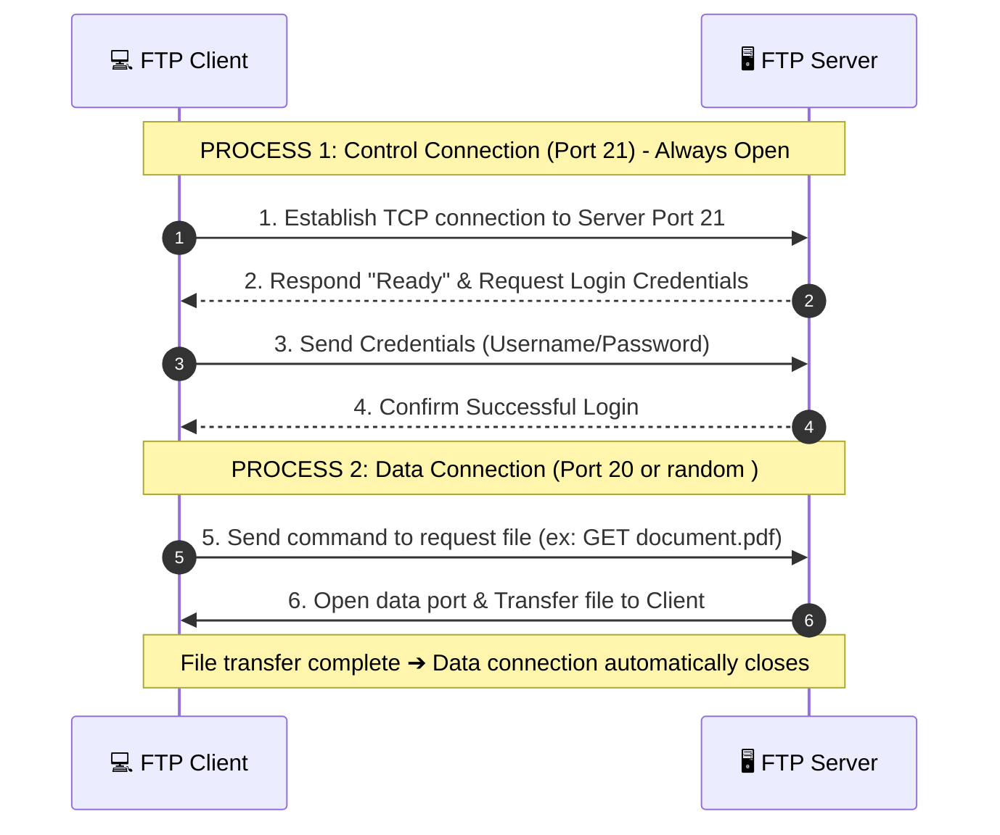

# 1. Stateless
- A stateless application does not retain any session information or state about past requests.

- The server doesn’t remember you or what you did before. It processes the requests, sends back a response, and then forgets everything about the interaction.

-  example is a simple search query on the web: if you search for something on a search engine and then perform another search, the second operation doesn’t rely on any memory of the first

application: HTTP, UDP, DNS

# 2. Statelful
- A stateful application is an application that stores data about past interactions between requests.

-  example, when you visit a shopping website, you add something to your cart, and the next time you log in, you'll see it in your cart

- In stateful web services, user data might be stored in memory or local storage on the server to track sessions or transaction

- Similarly, a stateful web server might store your login status and user profile in memory once you authenticate 
    -> FB, Zalo, student website ..

- They often respond faster for a user once the session is established because it has saved previous requests and responses.

application: FTP

# -> Final
Although HTTP is a stateless protocol – it doesn't store any client data after each interaction.

But in real life, modern web applications need to maintain state -> EX: account, shopping cart

=>>  Solution: Use cookies/sessions/tokens to store information on the client or server side, helping the website "remember" the user even though HTTP itself doesn't store anything.

# Note
UDP (Stateless) — no need to remember anything

UDP on a connectionless model —> each packet is sent completely independently, without needing a handshake beforehand, the server no need to remember which packet it received 

TCP (Stateful) — needs to remember the connection state

In TCP, before transmitting any data, the two parties must establish a connection through a process called a three-way handshake.

    - the 3-way handshake to establish a connection and maintain that connection throughout the data transmission session.

# FTP - File Transfer Protocol

- This is an example of a stateful application, as it needs to maintain the session state throughout your interaction with the server

- FTP uses reliable transmisssion control protocol at the transport layer (TCP)

## How does FTP work?

-The FTP model is designed around two logical channels in the communication process between the client and the server: the control connection and the data connection.

- process 1 Control connection

    ->Task: Establish connection, authenticate user

- process 2 Data connection
    ->Task: Perform actual file transfer (Upload/Download) or directory

- Disadvantages:

    The FTP protocol is completely unencrypted. 

    This means that the username and password used to log into the FTP server will be in cleartext
    -> anyone can read this information

- Solution:

    FTPS (FTP + TLS): This is still traditional FTP but with an added layer of TLS encryption to protect data.

    SFTP (SSH File Transfer Protocol): run in SSH

    -> All data and control commands are securely encrypted. This is currently the most widely used protocol for server administration