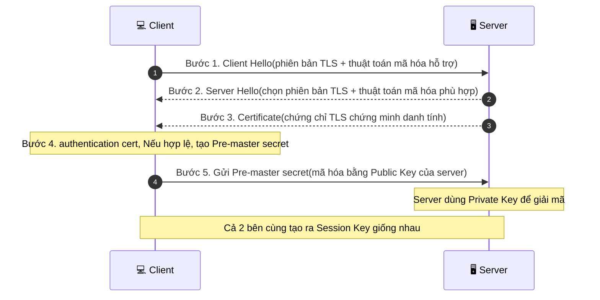
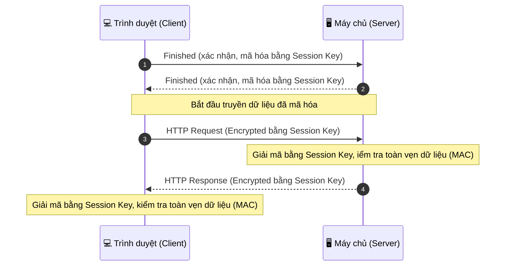

# TLS - Transport layer security
## 1.1 TLS là giao thức bảo mật phổ biến. Hoạt động theo mô hình CLient - Server chức năng chính là mã hóa dữ liệu truyền tải

### 1.2 TLS hoạt động 2 giai đoạn chính
Giai đoạn 1: TLS Handshake 

Giai đoạn 2; Mã hóa dữ liệu 

## Mã hóa đối xứng (Symmetric) và bất đối xứng (Asymmetric)

### a) Mã hóa đối xứng: 

sử dụng duy nhất một khóa cho cả hai quá trình mã hóa và giải mã, cả Client và Server phải có cùng 1 khóa bí mật này trước khi trao đổi dữ liệu.

Mã hóa đối xứng thường được dùng trong giai đoạn truyền dữ liệu

- Dùng Symmetric (AES/ChaCha20) với Session Key vừa tạo

   → Mã hóa toàn bộ dữ liệu HTTP suốt phiên kết nối

   → Vì tốc độ nhanh, phù hợp truyền liên tục nhiều dữ liệu

### b) Mã hóa bất đối xứng 

Dùng 2 khóa khác nhau nhưng có liên hệ toán học: Public Key (công khai, ai cũng có thể biết) và Private Key (bí mật, chỉ chủ sở hữu giữ)

Mã hóa bất đối xứng được dùng trong giai đoạn HandShake

- Dùng Asymmetric (RSA/ECDHE) 

   → Chỉ để trao đổi 1 lần duy nhất: tạo ra Session Key chung

   → Vì chỉ làm 1 lần, chấp nhận được độ chậm

So Sánh nhanh 

| | Symmetric (đối xứng) | Asymmetric (bất đối xứng) |
|---|---|---|
| Số khóa | 1 khóa chung (mã hóa và giải mã dùng chung) | 2 khóa: Public Key (công khai) + Private Key (bí mật) |
| Tốc độ | Rất nhanh | Chậm hơn nhiều |
| Độ dài khóa để cùng mức an toàn | Ngắn hơn (VD: AES-256) | Dài hơn (VD: RSA-2048/4096) |
| Vấn đề chính | Khó trao đổi khóa ban đầu an toàn | Tốc độ tính toán chậm |
| Dùng trong TLS ở giai đoạn | Giai đoạn 2 — mã hóa dữ liệu HTTP | Giai đoạn 1 — handshake, trao đổi khóa |
| Thuật toán phổ biến | AES, ChaCha20 | RSA, ECDHE, ECDSA |

## MAC (Message Authentication Code)
 MAC ở đây khác MAC address (địa chỉ vật lý card mạng) — đây là 1 khái niệm bảo mật riêng.

 MAC là 1 đoạn mã ngắn, được tính từ dữ liệu + Session Key, dùng để kiểm tra xem dữ liệu có bị thay đổi trong lúc truyền đi hay không.

### Cách hoạt động

- Client:

    Có dữ liệu gốc (VD: HTTP request)

    Dùng Session Key + thuật toán hash → tạo ra MAC

    Gửi đi: [Dữ liệu đã mã hóa] + [MAC]

- Server:

    Giải mã dữ liệu

    Tự tính lại MAC từ dữ liệu vừa nhận (cùng Session Key, cùng thuật toán)

    So sánh MAC tự tính với MAC nhận được

→ Nếu khớp: dữ liệu còn nguyên vẹn, không bị ai chỉnh sửa giữa đường

→ Nếu hông khớp: dữ liệu đã bị can thiệp → từ chối, báo lỗi

    
