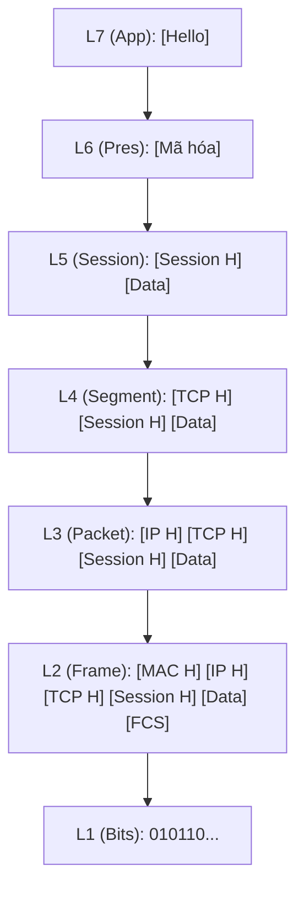
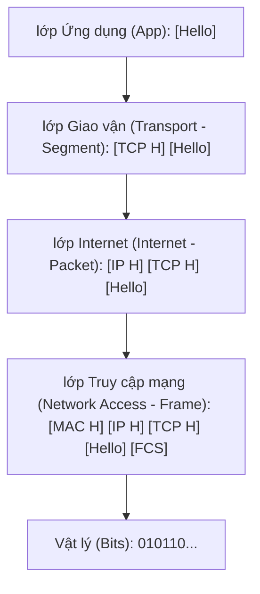

# Networking Theory
### 1. MAC address & IP address
|  | MAC | IP|  |
| :--- | :--- | :--- | :--- |
| Bản chất| physical address | logic address |
| Tính chất | Cố định | Thay đổi |
| Độ dài | 48 bits hexadecimal (00:1A:2B:3C:4D:5E)  | 32bits(IPv4), 128bits(IPv6) (192.168.1.1) |
| Layer hoạt động | Data link ( layer 2) |  Network (layer 3) |
### 2. Mô hình OSI 7 lớp
Tưởng tượng mỗi máy tính nói 1 ngôn ngữ riêng biệt thì OSI chính là quy tắc để chúng giao tiếp được với nhau theo 1 quy chuẩn cố định
* __lớp 7 Application:__  Ứng dụng phục vụ người dùng, quản lí cung cấp giao diện, dịch vụ trực tiếp
* __lớp 6 Presentation:__ Biên dịch, mã hóa, nén và giải mã dữ liệu để các lớp khác có thể hiểu và hiển thị được.
* __lớp 5 Session:__ Chịu trách nhiệm điều phối mạng giữa hai ứng dụng riêng biệt trong một phiên 
* __lớp 4 Transport:__ Chịu trách nhiệm vận chuyển dữ liệu end to end, phân tách dữ liệu thành các segment, quản lý, sửa lỗi
* __lớp 3 Network:__ Quản lý địa chỉ logic thực hiện định tuyến routing để tìm đường đi cho các packet
* __lớp 2 Data link:__ Đóng gói dữ liệu thành các Frame để truyền đi (quản lí địa chỉ MAC)
* __lớp 1 Physical:__ Xử lý dữ liệu thành bits thô (binary) để truyền đi qua môi trường vật lí
* VD: Dữ liệu gốc [ Hello ]

_OSI bản chất là 1 mô hình lí thuyết không được triển khai trong thực tế, nhưng nó có giá trị tham chiếu để hiểu mạng và dễ khắc phục sự cố bằng cách cô lập xem lỗi mạng nằm ở layers nào_
### 2. Mô hình TCP/IP 4 lớp
Là giao thức nền tảng của internet, khác với osi TCP/IP chỉ chia quá trình mạng thành 4 lớp:
* __lớp 4 Application:__  Nơi người dùng tương tác trực tiếp với mạng giống ở layer 7 OSI  (nhưng bao gồm 3 lớp application, presentation, session)
* __lớp 3 Transport:__ Đóng vai trò duy trì kết nối đầu cuối và đảm bảo truyền dữ liệu an toàn, phân tách dữ liệu (segment)
* __lớp 2 Internet:__ Quản lý địa chỉ logic thực hiện định tuyến routing để tìm đường đi cho các packet ( tương tự lớp network ở OSI )
* __lớp 1 Network Access__: Gộp lớp liên kết dữ liệu (Data Link) và lớp Vật lý (Physical) của OSI làm một 

*__VD Cùng là gói tin [ Hello ]__

### 3. So sánh
| Mô hình OSI (7 lớp) | Mô hình TCP/IP (4 lớp) | Chức năng chính |
| :--- | :--- | :--- |
| Ứng dụng (lớp 5 + 6 + 7) | 1. Ứng dụng (Application) | Giao tiếp phần mềm (HTTP, FTP). |
| Giao vận (lớp 4) | 2. Giao vận (Transport) | Quản lý kết nối dữ liệu (TCP, UDP). |
| Mạng (lớp 3) | 3. Internet | Định tuyến đường đi gói tin (IP). |
| Vật lý & Liên kết (lớp 1 + 2) | 4. Truy cập mạng (Network Access) | Truyền tín hiệu, phần cứng (Cáp, Wi-Fi). |
### 4. TCP và UDP
- Là 2 giao thức truyền tải dữ liệu qua mạng phổ biến hiện nay, đặc điểm nổi bật riêng biệt :
    - TCP (Transmission control protocol) Đảm bảo dữ liệu đến đích nguyên vẹn và đúng thứ tự. Nếu gói tin bị mất, nó sẽ yêu cầu gửi lại.
    - UDP (User datagram protocol) ruyền dữ liệu cực nhanh nhưng không đảm bảo gói tin có đến nơi hay không. Các gói tin có thể đến sai thứ tự hoặc bị mất.

| | TCP | UDP |
| :--- | :--- | :--- |
| **Bản chất** | Hướng kết nối (Connection-oriented) | Không kết nối (Connectionless) |
| **Độ tin cậy** | Cao (Có kiểm tra lỗi và gửi lại) | Thấp (Không có cơ chế khôi phục dữ liệu) |
| **Tốc độ** | Chậm hơn | Rất nhanh |
| **Thứ tự dữ liệu** | Đảm bảo đúng thứ tự | Không đảm bảo |
| **Kiểm soát luồng** | Có (Điều chỉnh tốc độ gửi) | Không  |
| **Kích thước tiêu đề (Header)** | Lớn (20 byte) | Nhỏ (8 byte) |
